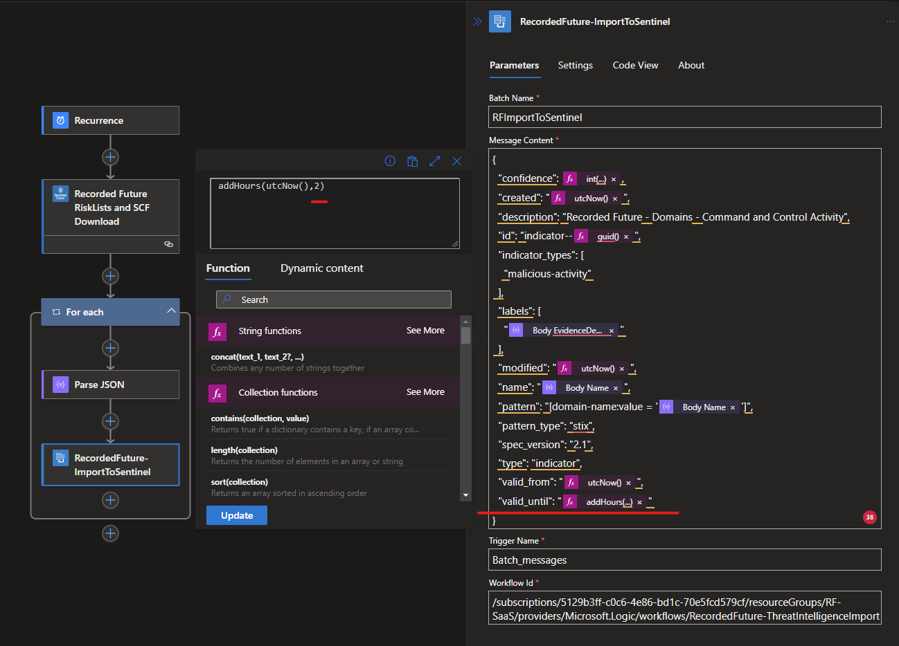

# Recorded Future Indicator/Risk List playbooks

More information about Recorded Future Intelligence Solution for Microsoft Sentinel can be found in the main [readme](../readme.md).

All **IndicatorImport** playbooks have the RecordedFuture-ThreatIntelligenceImport as a prerequisite. So always setup the RecordedFuture-ThreatIntelligenceImport first as part och the solution installation or as a single playbook installation below.  

> [!IMPORTANT] 
> **Due to internal dependencies, always deploy and activate the ThreatIntelligenceImport playbook before any of the \*-IndicatorImport playbooks.**

## Risk list size limitations
The size and number of indicators imported is limited by logic apps file size and number of items. [Read more here](https://learn.microsoft.com/en-us/azure/logic-apps/logic-apps-limits-and-config?tabs=consumption%2Cazure-portal)

## RecordedFuture-ThreatIntelligenceImport
Type: **Detection**\
Included in Recorded Future Intelligence Solution: **Yes**\
Requires authorization of **/azuresentinel** connector - [Documentation on Microsoft power platform connectors](https://learn.microsoft.com/en-us/connectors/azuresentinel/)

The parameter WorkspaceID can be found in Azure portal in the overview page of the Log Analytics Workspace. 

Retrieves Indicators Of Compromise (IoCs) from one of the indicator import logic apps, and store them in the ThreatIntelligenceIndicator table. All IndicatorImport playbooks use this playbook for batching. 

[](https://portal.azure.com/#create/Microsoft.Template/uri/https%3A%2F%2Fraw.githubusercontent.com%2FAzure%2FAzure-Sentinel%2Fmaster%2FSolutions%2FRecorded%2520Future%2FPlaybooks%2FIndicatorImport%2FRecordedFuture-ThreatIntelligenceImport%2Fazuredeploy.json)
[](https://portal.azure.us/#create/Microsoft.Template/uri/https%3A%2F%2Fraw.githubusercontent.com%2FAzure%2FAzure-Sentinel%2Fmaster%2FSolutions%2FRecorded%2520Future%2FPlaybooks%2FIndicatorImport%2FRecordedFuture-ThreatIntelligenceImport%2Fazuredeploy.json)

## RecordedFuture-Domain-IndicatorImport
Type: **Detection**\
Included in Recorded Future Intelligence Solution: **Yes**\
Requires **/recordedfuturev2** API keys as described in the [Connector authorization](../readme.md##connectors-authorization) section. 

Retrieves the [Microsoft Sentinel Domain Default Risk List ](https://support.recordedfuture.com/hc/en-us/articles/115003793388-Domain-Risk-Rules) (requires login), Domain IOC with risk greater than 65 and adds the IOCs to the ThreatIntelligenceIndicator table.

[](https://portal.azure.com/#create/Microsoft.Template/uri/https%3A%2F%2Fraw.githubusercontent.com%2FAzure%2FAzure-Sentinel%2Fmaster%2FSolutions%2FRecorded%2520Future%2FPlaybooks%2FIndicatorImport%2FRecordedFuture-Domain-IndicatorImport%2Fazuredeploy.json)
[](https://portal.azure.us/#create/Microsoft.Template/uri/https%3A%2F%2Fraw.githubusercontent.com%2FAzure%2FAzure-Sentinel%2Fmaster%2FSolutions%2FRecorded%2520Future%2FPlaybooks%2FIndicatorImport%2FRecordedFuture-Domain-IndicatorImport%2Fazuredeploy.json)


## RecordedFuture-Hash-IndicatorImport
Type: **Detection**\
Included in Recorded Future Intelligence Solution: **Yes**\
Requires **/recordedfuturev2** API keys as described in the [Connector authorization](../readme.md##connectors-authorization) section. 

Retrieves the [Microsoft Sentinel Hash Observed in Underground Testing Risk List ](https://support.recordedfuture.com/hc/en-us/articles/115000846167-Hash-Risk-Rules) (requires login), Hashes based on the observedMalwareTesting Risk Rule and adds the IOCs to the ThreatIntelligenceIndicator table.

[](https://portal.azure.com/#create/Microsoft.Template/uri/https%3A%2F%2Fraw.githubusercontent.com%2FAzure%2FAzure-Sentinel%2Fmaster%2FSolutions%2FRecorded%2520Future%2FPlaybooks%2FIndicatorImport%2FRecordedFuture-Hash-IndicatorImport%2Fazuredeploy.json)
[](https://portal.azure.us/#create/Microsoft.Template/uri/https%3A%2F%2Fraw.githubusercontent.com%2FAzure%2FAzure-Sentinel%2Fmaster%2FSolutions%2FRecorded%2520Future%2FPlaybooks%2FIndicatorImport%2FRecordedFuture-Hash-IndicatorImport%2Fazuredeploy.json)

## RecordedFuture-IP-IndicatorImport
Type: **Detection**\
Included in Recorded Future Intelligence Solution: **Yes**\
Requires **/recordedfuturev2** API keys as described in the [Connector authorization](../readme.md##connectors-authorization) section. 

Retrieves the [Actively Communicating Validated C&C Server Risk List ](https://support.recordedfuture.com/hc/en-us/articles/115000894448-IP-Address-Risk-Rules) (requires login), Observing C2 communications with infected machines or adversary control by Recorded Future Network Traffic Analysis.

[](https://portal.azure.com/#create/Microsoft.Template/uri/https%3A%2F%2Fraw.githubusercontent.com%2FAzure%2FAzure-Sentinel%2Fmaster%2FSolutions%2FRecorded%2520Future%2FPlaybooks%2FIndicatorImport%2FRecordedFuture-IP-IndicatorImport%2Fazuredeploy.json)
[](https://portal.azure.us/#create/Microsoft.Template/uri/https%3A%2F%2Fraw.githubusercontent.com%2FAzure%2FAzure-Sentinel%2Fmaster%2FSolutions%2FRecorded%2520Future%2FPlaybooks%2FIndicatorImport%2FRecordedFuture-IP-IndicatorImport%2Fazuredeploy.json)

## RecordedFuture-URL-IndicatorImport
Type: **Detection**\
Included in Recorded Future Intelligence Solution: **Yes**\
Requires **/recordedfuturev2** API keys as described in the [Connector authorization](../readme.md##connectors-authorization) section. 

Retrieves the [Microsoft Sentinel URL Recently Reported by Insikt Group Risk List ](https://support.recordedfuture.com/hc/en-us/articles/115000894448-IP-Address-Risk-Rules) (requires login), URLs based on the Recently Reported by Insikt Group rule and adds the IOCs to the ThreatIntelligenceIndicator table.

[](https://portal.azure.com/#create/Microsoft.Template/uri/https%3A%2F%2Fraw.githubusercontent.com%2FAzure%2FAzure-Sentinel%2Fmaster%2FSolutions%2FRecorded%2520Future%2FPlaybooks%2FIndicatorImport%2FRecordedFuture-URL-IndicatorImport%2Fazuredeploy.json)
[](https://portal.azure.us/#create/Microsoft.Template/uri/https%3A%2F%2Fraw.githubusercontent.com%2FAzure%2FAzure-Sentinel%2Fmaster%2FSolutions%2FRecorded%2520Future%2FPlaybooks%2FIndicatorImport%2FRecordedFuture-URL-IndicatorImport%2Fazuredeploy.json)

# Configuration 
## Risk list activation and configuration 
Verify that the **ThreatIntelligenceImport** logic app is installed and active in your environment before installing the TIProcessing risk lists.

From ```Automation -> Playbook Template```  Select any Recorded Future playbook that ends with IndicatorImport, like **RecordedFuture-IP-IndicatorImport**, press create playbook.
Note that it is possible to deploy several instances of the same template by giving them unique names. This is how you can pull several risk lists of the same type.


The parameter **PlaybookNameBatching** is the name of the ThreatIntelligenceImport playbook that will handle batch processing of indicators into Microsoft Sentinel. In the last step press **Create and continue to designer**.


In the designer, locate all steps that show a warning and authenticate these steps. Authentication looks different for each connection. More information on this can be found in the chapter above called Connector Authorization. [More information about playbook authentication](https://learn.microsoft.com/en-us/azure/sentinel/authenticate-playbooks-to-sentinel).


## Change Risk List 
To can change Risk List to pull in to your environment. This can be done in the default playbook or you can install several instances of one playbook. 
Example: You would like to use both ```Actively Communicating Validated C&C Server``` and ```Recent Phishing Host``` ip Risk Lists. 
Select the **RecordedFuture-IP-IndicatorImport** template from ```Automation -> Playbook``` twice and save with different names like ```Recorded Future - Actively Communicating Validated C&C Server - IndicatorImport``` and ```Recorded Future - Phishing Host - IndicatorImport```. 

Change the Risk List to download and modify the description in the ```RecordedFuture-Threatlntelligencelmport``` step in the logic app. 


## Configure Cadence of Risk List Ingestion 
Its possible to adjust the cadence of Risk List download to reduce traffic and cost. Recorded Future have the following recommendations [Risk-List-Download-Recommendations](https://support.recordedfuture.com/hc/en-us/articles/115010401968-Risk-List-Download-Recommendations) (Require Recorded Future Login).

The first step of IndicatorImport Playbooks is a recurrence step, adjust the cadence by modifying the interval and frequency parameters.\


It is critical that you also adjust the expirationDateTime parameter in the final block of that logic app to be synchronized with the recurrence timing. Failure to do so can result in either:
* Duplication of indicators.
* Having no active Recorded Future indicators the majority of the time. 

If you are unsure of how to do this, please consult Recorded Future.



## Verify deployment
After successfully running indicator import, there should exist data in  the ThreatIntelligenceIndicator table.


