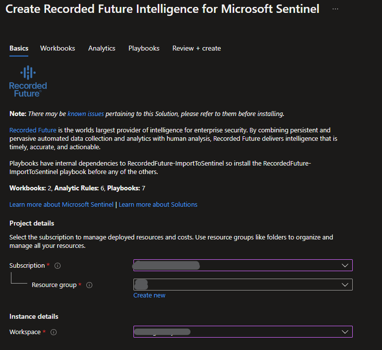
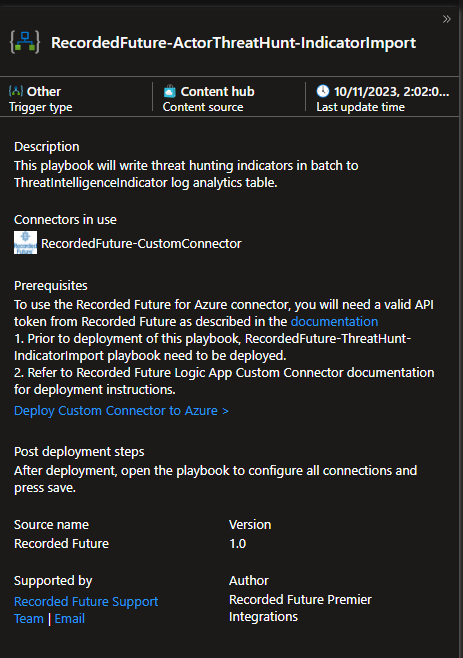
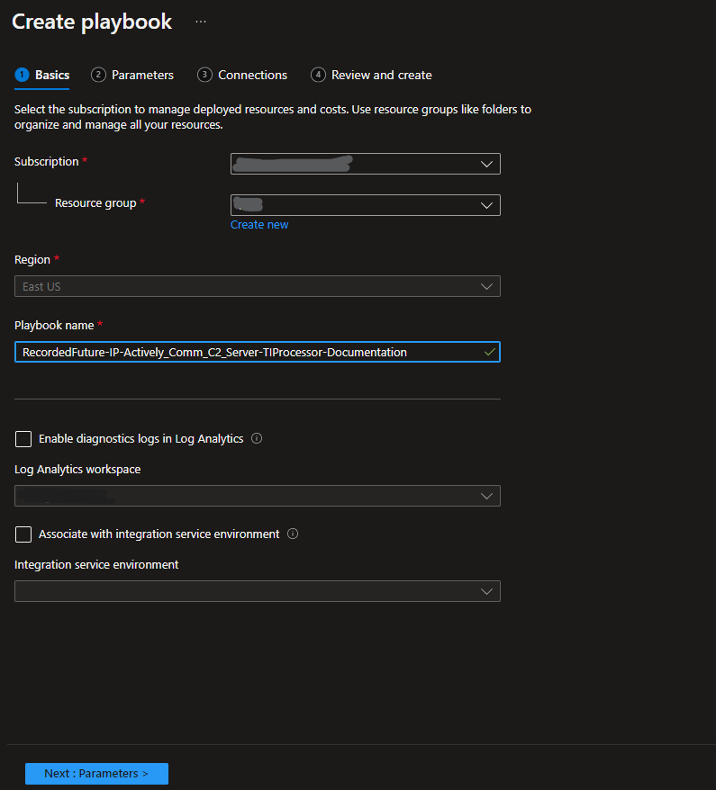
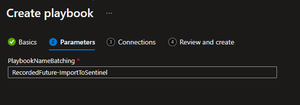
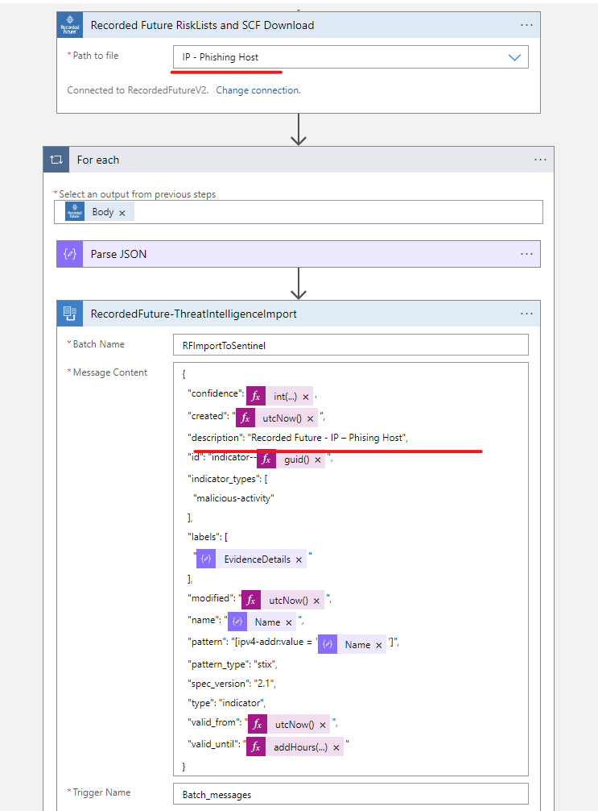
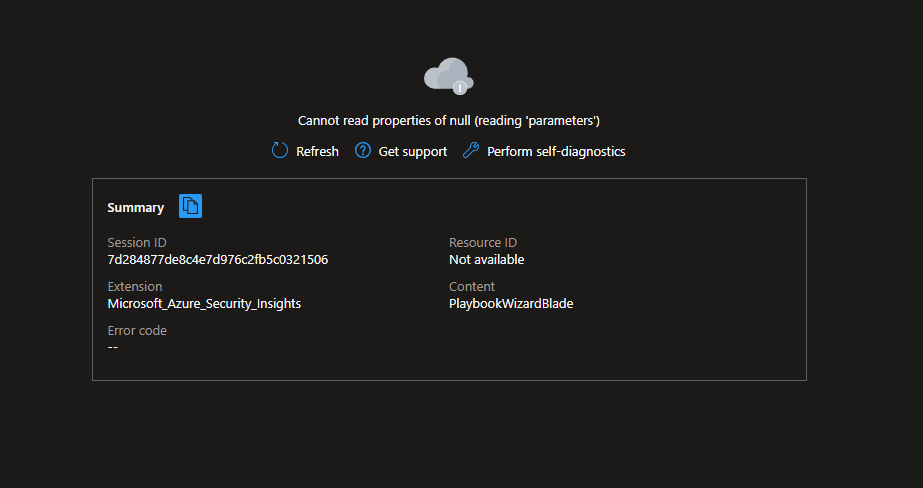
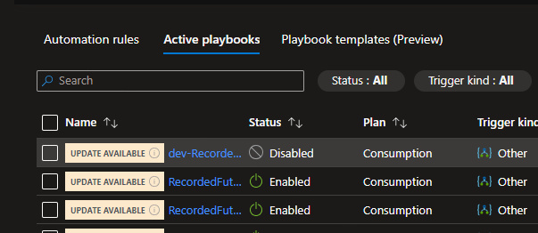

[](https://www.recordedfuture.com/)
# Recorded Future Intelligence for Microsoft Sentinel

# Before You Begin

## Roles and Permissions

Microsoft article that describes roles and permissions in Microsoft Sentinel [Roles and permissions in Microsoft Sentinel](https://learn.microsoft.com/en-us/azure/sentinel/roles).

Following permissions are required on the resource group level [Microsoft Sentinel Contributor](https://learn.microsoft.com/en-us/azure/role-based-access-control/built-in-roles#microsoft-sentinel-contributor) and [Logic App Contributor](https://learn.microsoft.com/en-us/azure/role-based-access-control/built-in-roles#logic-app-contributor).

## Prerequisites  

The **Threat Intelligence** solution from Microsoft Sentinel Content Hub must be installed for indicators to be forwarded to Microsoft Sentinel ThreatIntelligenceIndicator log table. The Threat Intelligence Solution contains both the deprecated **Threat Intelligence Platforms Data Connector** and the new **Threat Intelligence Upload Indicators API**.


## Connectors Authorization 
Each connector need to be authorized after playbook/logic app installation. Expand all nodes in the logic app after installation and look for blocks marked with a warning sign. Open and authorize all connections.

Recorded Future requires API keys to communicate with our API. To obtain API keys. [Start a 30-day free trial of Recorded Future for Microsoft Sentinel from here!](https://go.recordedfuture.com/microsoft-azure-sentinel-free-trial?utm_campaign=&utm_source=microsoft&utm_medium=gta) or visit [Recorded Future Requesting API Tokens](https://support.recordedfuture.com/hc/en-us/articles/4411077373587-Requesting-API-Tokens) (Require Recorded Future Login) and request API token for ```Recorded Future for Microsoft Sentinel``` or/and ```Recorded Future Sandbox for Microsoft Sentinel```.

<br/>
or\


The Recorded Future solution uses the following connectors:
- **/recordedfuturev2** - [Microsoft power platform connector](https://learn.microsoft.com/en-us/connectors/recordedfuturev2/). 

- **/RecordedFuture-CustomConnector** - [RecordedFuture-CustomConnector](Connectors/RecordedFuture-CustomConnector/readme.md)

- **/recordedfuturesandbo** - [Microsoft power platform connector](https://learn.microsoft.com/en-us/connectors/recordedfuturesandbo/).

- **/azuresentinel** - [Documentation on Microsoft power platform connectors](https://learn.microsoft.com/en-us/connectors/azuresentinel/)

- **/microsoftgraphsecurity** - [Documenation on Microsoft power platform connectors](https://learn.microsoft.com/en-us/connectors/microsoftgraphsecurity/). The playbooks using this API is being DEPRECATED and will transition to new playbooks using azuresentinel api.

## Ingestion and Operational costs
Playbook(Logic apps) may result in additional ingestion or operational costs:

1. [Usage metering, billing, and pricing for Azure Logic Apps](https://learn.microsoft.com/en-us/azure/logic-apps/logic-apps-pricing)

1. [Azure Monitor Logs cost calculations and options](https://learn.microsoft.com/en-us/azure/azure-monitor/logs/cost-logs)

Recorded Futures risk lists are generated at different cadences as described in this support article [Risk List Download Recommendations](https://support.recordedfuture.com/hc/en-us/articles/115010401968-Risk-List-Download-Recommendations) (Require Recorded Future Login). It is possible to adjust cadence to decrease cost of data processing.

# Installation

There are two options for installing playbooks and starting automate threat response:

1. Installing the solution from [Content Hub](https://portal.azure.com/#view/Microsoft_Azure_Marketplace/GalleryItemDetailsBladeNopdl/dontDiscardJourney~/true/id/recordedfuture1605638642586.recorded_future_sentinel_solution). (Recommended)

1. Installing the playbooks one by one by from this Readme further down in this document.

## 1.Content Hub Installation

1. Locate the Recorded Future Solution in the Content Hub.

1. Press **Install** and then **Create** and continue to configure the solution. 

1. If the installation was completed successfully, you will now have Workbook templates, Automation Playbook templates and Analytic Rules templates.

Note that the solution  install templates and you have to use the templates to install workbooks, playbooks and analytic rules. 


When installing playbooks from templates, read the description and lookout for dependencies that might have to be installed


## 2.Playbooks one by one installation
To install individual playbooks one by one, use the buttons next to the descriptions of the individual playbooks further down in this document.

> **Due to internal dependencies, please deploy and activate the ThreatIntelligenceImport playbook before any of the \*-IndicatorImport playbooks.**

# Upgrade from previous versions

Information about latest released version number can be found in Recorded Future Intelligence Solution [release notes](../ReleaseNotes.md). There can be delay to the version available inside the content hub and whats in listed here due to publish/rollout time.  

### From version 2.4
We are deprecating the RecordedFuture-ImportToSentinel and all *-TIProcessor playbooks. You need to install the new IndicatorImport playbooks and configure them to download you selection of risk lists. Investigate the risk lists being downloaded and the cadence and use the same configuration using the TIProcessor playbooks. Use the same description for threat indicators if you have analytic rules set up for alerting. 

Our support will end when Microsoft decommission the underlying API. More information can be found on [Microsoft Learn](https://learn.microsoft.com/en-us/azure/sentinel/understand-threat-intelligence#add-threat-indicators-to-microsoft-sentinel-with-the-threat-intelligence-platforms-data-connector)

### From version 1
If you have a version 1 installation you need to first acquire a V2 APi key from Recorded Future. Install the new all IndicatorImport and enrichment -playbooks. Select a different name than the once already installed and reauthenticate them. Configure the IndicatorImport playbooks to pull your selection of risk lists. After validating that the new playbooks works as expected you can deactivate the V1 versions. 

# Configuration 
## Risk list configuration 
Verify that the **ThreatIntelligenceImport** logic app is installed and active in your environment before installing the TIProcessing risk lists.

From ```Automation -> Playbook Template```  Select any Recorded Future playbook that ends with IndicatorImport, like **RecordedFuture-IP-IndicatorImport**, press create playbook.
Note that it is possible to deploy several instances of the same template by giving them unique names. This is how you can pull several risk lists of the same type.



The parameter **PlaybookNameBatching** is the name of the ThreatIntelligenceImport playbook that will handle batch processing of indicators into Microsoft Sentinel. In the last step press **Create and continue to designer**.


In the designer, locate all steps that show a warning and authenticate these steps. Authentication looks different for each connection. More information on this can be found in the chapter above called Connector Authorization. [More information about playbook authentication](https://learn.microsoft.com/en-us/azure/sentinel/authenticate-playbooks-to-sentinel).


## Change Risk List 
To can change Risk List to pull in to your environment. This can be done in the default playbook or you can install several instances of one playbook. 
Example: You would like to use both ```Actively Communicating Validated C&C Server``` and ```Recent Phishing Host``` ip Risk Lists. 
Select the **RecordedFuture-IP-IndicatorImport** template from ```Automation -> Playbook``` twice and save with different names like ```Recorded Future - Actively Communicating Validated C&C Server - IndicatorImport``` and ```Recorded Future - Phishing Host - IndicatorImport```. 

Change the Risk List to download and modify the description in the ```RecordedFuture-Threatlntelligencelmport``` step in the logic app. 


## Configure Cadence of Risk List Ingestion 
Its possible to adjust the cadence of Risk List download to reduce traffic and cost. Recorded Future have the following recommendations [Risk-List-Download-Recommendations](https://support.recordedfuture.com/hc/en-us/articles/115010401968-Risk-List-Download-Recommendations) (Require Recorded Future Login).

The first step of all IndicatorImport Playbooks is a recurrence step, it is possible to adjust the cadence by modifying the interval and frequency parameters.\


If you do so however, it is critical that you also adjust the expirationDateTime parameter in the final block of that logic app to be synchronized with the recurrence timing. Failure to do so can result in either:
* Duplication of indicators.
* Having no active Recorded Future indicators the majority of the time. 

If you are unsure of how to do this, please consult Recorded Future Professional Services.


## Automate Incident Enrichment
After one of the enrichment playbooks is installed and all connections are configured. Create an automation rule to automate the enrichment process. This will automate  enrichment of Recorded Future intelligence to known entities in all incidents. 

<br/>

In Microsoft Sentinel, go to Automation and create **Automation rule**. Give the new rule a name, select the trigger **When incident is created**, select the action **Run playbook** and finally select **RecordedFuture-IOC_Enrichment-IP_Domain_URL_Hash** or **RecordedFuture-Sandbox_Enrichment-Url** as the playbook. 

<br/>

This will trigger the Recorded Future playbook to run when any incident is created. Recorded future will then enrich the incident if it contains entities of types IP, Domain, Url or FileHash. 

## Recorded Future Collective Insights Configuration
The Recorded Future Collective Insights aggregates data related to Sigma Rules and other indicators, driving collective insights to better identify threats. Anonymized, unattributable data is collected for analytical purposes to identify trends and insights with the Collective Insights. The **RecordedFuture-IOC_Enrichment-IP_Domain_URL_Hash** playbook gives end users the ability to contribute collective insights to the Collective Insights.
[Click here to learn more](https://support.recordedfuture.com/hc/en-us/articles/19308547864339) (Require Recorded Future Login)


## Query Risk Lists
After successfully running and importing one or more Risk Lists it is possible to query the imported data in your Log Analytics Workspace. 

Example queries:  
``` sql 
//  List 10 rows from ThreatIntelligenceIndicator log imported from Recorded Future
ThreatIntelligenceIndicator
| where Description contains "Recorded Future"
| take 10

// List 10 rows from ThreatIntelligenceIndicator log imported from the  
// IP - Actively Communicating C&C Server Risk List 
ThreatIntelligenceIndicator
|where Description == "Recorded Future - IP - Actively Communicating C&C Server"
| take 10

//  List 10 rows from ThreatIntelligenceIndicator log imported from Recorded Future
ThreatIntelligenceIndicator
|where Description == "Recorded Future - IP - Actively Communicating C&C Server" and AdditionalInformation contains "Cobalt Strike"
| take 10
```


## Activate Automation Rules for IoC enrichment 
After installing enrichment playbooks do not forget to automatically enrichment of IOCs in all created incidents by following the steps below: 

1. Open Microsoft Sentinel.
2. Go to Automation and select *Create Automation rule*
3. Name the rule
4. Select the following options:
   * Trigger: **When an incident is created**
   * Action: **Run playbook**
   * Playbook (must first be successfully configured): 
     - [**RecordedFuture-IOC_Enrichment-IP_Domain_URL_Hash**](#recordedfuture-ioc_enrichment-ip_domain_url_hash) or
     - [**RecordedFuture-Sandbox_Enrichment-Url**](Sandboxing/readme.md#recordedfuture-sandbox_enrichment-url)
5. Done

The Recorded Future playbook is now configured to run when incidents are triggered, and it will enrich the following IOC types: IP, Domain, URL, or Hash.

# Playbooks
Note that all playbooks are not included in the Solution. It is stated in the description for each playbook as Included in Solution: Yes/No. The playbooks that are not included is considered preview and might be included in future versions.  

Playbooks in subfolders:
- [Enrichment Playbooks](Enrichment/readme.md)
- [Indicator Import/Risk List Playbooks](IndicatorImport/readme.md)
- [Alert Playbooks](Alerts/readme.md)
- [Sandbox Playbooks](./Sandboxing/readme.md)
- [Recorded Future Threat Hunt Playbooks](./ThreatHunting/readme.md)
- [Recorded Future Custom Connector](./Connectors/RecordedFuture-CustomConnector/readme.md)
- [Deprecated but still supported Risk List Playbooks](Deprecated/readme.md)


# Known Issues 
## Version 3.0
Microsoft Sentinel playbook upgrade experience can result in the following error: ```Cannot read properties of null (reading 'parameters')```


A workaround is to reinstall and overwrite the playbooks from the template in Playbook Template tab and not using the upgrade wizard. Before overwriting an active playbook make note of the risk list downloaded, the description, cadence of downloading. 

