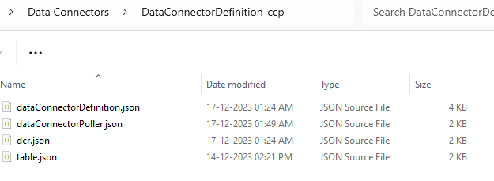
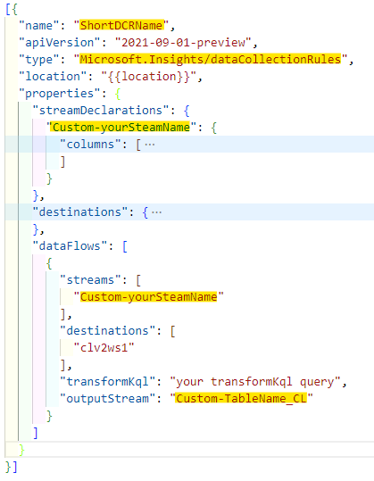
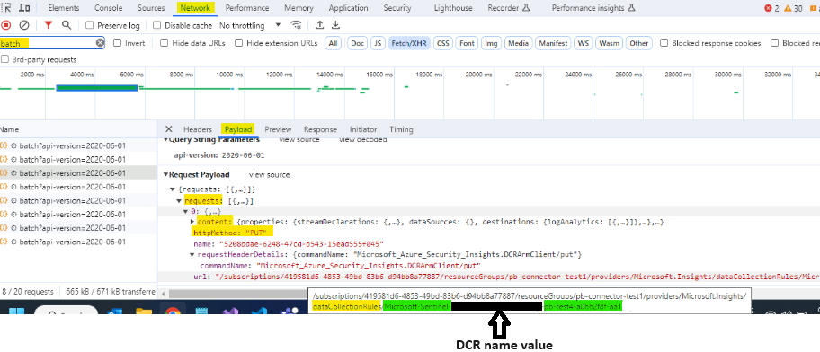

# Microsoft Sentinel Solutions Packaging Tool Guidance For CCP Connector

To create a package using V3 packaging tool refer [Link to V3](https://github.com/Azure/Azure-Sentinel/blob/master/Tools/Create-Azure-Sentinel-Solution/V3/README.md)

## CCP connector Building Blocks:
Every CCP connector will have 4 building blocks and should be specified in sequence given below:
1. Data Connector Definition - Consider this an a UI page shown after deployment to users and contains instruction steps and connectorUiConfig section.
2. Data Connectors (Poller) - This will contain details to connect to your REST API and has a poller details.
3. Data Collection Rule - Specify, what data should be collected, how to transform that data, and where to send it.
4. Tables (Optional) - Stores your data logs.

## How to Use ?
1. In Data input file under Azure-Sentinel/Solutions, open the solution you want to add a CCP connector.
2. Open data input file and under "Data Connectors" array object add a path to new dataConnectorDefinition file.
3. File name to dataConnectorDefinition should be meaningful and recommended to have a suffix "Definition" attached to the name at the end e.g. dataConnectorDefinition.json.
4. Navigate to your "Solutions/*yourSolutionName*/Data Connectors" folder and create a new folder for ccp suffix at the end e.g: DataConnectorDefinitionName_ccp".
5. Once a folder for CCP is created then add/create 4 files dataConnectorDefinition.json, dataPoller.json, DCR.json and table.json. Here table.json file is optional. Also, you can specific a different naming to the files but having a suffix of "Definition", "Poller", "DCR", "Table" in the file name at the end will be easy to correlate. Below is an example folder file structure for CCP.

    

6. There can be only 1 data definition file per CCP connector. If you have multiple CCP connectors then create multiple data connector definition files and specify the file paths in the data folder input file under "Data Connectors" array. There is no need to specify other file paths for poller, dcr or tables in data input file. 
7. dataConnectorDefinition file is the starting point for any CCP connector and this file path should only be specified in data folder input file under "Data Connectors" array.

    

8. Mapping between dataConnectorDefinition and Poller file should present. Poller file mapping with DCR should be present. If mapping is not present and if present but mapping values are not correct then packaging will fail.

    #### *<span style="color:blue">Note:</span> <span style="color:green">Each of this files depend on mapping with other files which is specified in "How to Use ?" section of this document. Eg: Data definition file should have a mapping with Data poller file. Data poller file should have a mapping with DCR file. DCR file should have a mapping with Tables file. Tables file is optional and so, if there is no mapping from DCR with table then remove the "outputStream" property from "DCR" file. You can skip removing property "outputStream" from DCR file, if it is a Standard table eg: "outputStream"="Microsoft-ASimNetworkSessionLogs" in DCR is a Standard table and there is no need to add table file.</span>*

    ### Working with Single Data Definition having multiple Data Connector Poller in single file and multiple DCR in single file:

    If you have only 1 data definition file and want to use it with multiple data connector pollers, DCR's files then create only 1 data definition file. Keep the single data definition file at the root of the "Data Connectors" folder i.e. keep data definition file inside of "Data Connectors" folder and keep each of the poller, DCR and/or table files in a separate folders as shown in below screenshot.

      <h4><span style="color:purple"> Folder and file structure for Single data definition file with multiple folders containing poller and DCR: </span> </h4>

      


      <h4><span style="color:purple"> Below is the single data definition file which is similar to that of normal CCP connector which contains only one data definition file, data connector poller file, dcr file and/or table file. </span></h4> 

      

      <h4><span style="color:purple"> This data connector poller file differs with normal CCP connector by having multiple JSON object in an array as shown below i.e. multiple data connector pollers are specified in a single file. </span></h4> 

      

      <h4><span style="color:purple"> Below is the content for multiple data connector poller object specified in a single file inside of an array. For single data definition having multiple data connector poller, green color highlighted property value should be unique i.e "name" property should be unique and should not match this name value with other data connector poller name property in this file i.e. "name" = "CiscoMerakiAPIRequest" should be unique. But "connectorDefinitionName" value for all of the data connector poller files should be SAME as shown below as we are using only 1 data definition file.</span></h4> 

      


      <h4><span style="color:purple">  Each of the data connector poller files in previous step should have a corresponding DCR file object as shown below. In data connector poller file, "streamName" property value should match with that of DCR file object "streams" property under "dataFlows" array as shown below. Under "dataFlows" specify different objects for your streams. </span></h4> 

      

</br>

9. Details for each of the file information is specified below:</br>
  **a. Data Connector Definition File:**
    - The "type" property value should be "Microsoft.SecurityInsights/dataConnectorDefinitions".

      

    - Below is a sample data connector definition file and will show field and details on UI package in data connector page.
    - Curly braces placeholder eg: {{location}}) value will be replaced with parameters after packaging using V3 tool.
    - In this file, "connectorUiConfig" section should always have a "id" field with a name without space.

      
    
    - This "id" value is important to have a mapping between data connector definition and a poller file.
    - The field "name" and "id" should be kept same.
    - InstructionSteps can be basic/oauth or of other types and keep rest of the key value pairs as is.
    - Keep rest all properties of the file as is.

```json
{
  "type": "Microsoft.SecurityInsights/dataConnectorDefinitions",
  "apiVersion": "2022-09-01-preview",
  "name": "<NameofYourDefinition>",
  "location": "{{location}}",
  "kind": "Customizable",
  "properties": {
    "connectorUiConfig": {
      "id": "<NameofYourDefinitionWithoutSpace>",
      "title": "<Title for the CCP Connector>",
      "publisher": "<Publisher Name>",
      "descriptionMarkdown": "<Enter the description>",
      "graphQueriesTableName": "<Enter the table Name>",
      "graphQueries": [
        {
          "metricName": "Total events received",
          "legend": "<Name of your Events>",
          "baseQuery": "{{graphQueriesTableName}}"
        }
      ],
      "sampleQueries": [
        {
          "description": "Get Sample Events",
          "query": "{{graphQueriesTableName}}\n | take 10"
        }
      ],
      "dataTypes": [
        {
          "name": "{{graphQueriesTableName}}",
          "lastDataReceivedQuery": "{{graphQueriesTableName}}\n | where TimeGenerated > ago(12h) | where name_s == \"no data test\" | summarize Time = max(TimeGenerated)\n | where isnotempty(Time)"
        }
      ],
      "connectivityCriteria": [
        {
          "type": "HasDataConnectors"
        }
      ],
      "availability": {
        "isPreview": false
      },
      "permissions": {
        "resourceProvider": [
          <specify resources and permission here>
        ]
      },
      "instructionSteps": [
        {
          "description": "Connect using OAuth2 credentials",
          "instructions": [
            {
              "type": "OAuthForm",
              "parameters": {
                "clientIdLabel": "Client ID",
                "clientSecretLabel": "Client Secret",
                "connectButtonLabel": "Connect",
                "disconnectButtonLabel": "Disconnect"
              }
            }
          ],
          "title": "Connect <Solution Name> to Microsoft Sentinel"
        }
      ]
    }
  }
}
```

  **b. Data Poller File:**
  - The "type" property value should be "Microsoft.SecurityInsights/dataConnectors".
  - If a file contains "connectorUiConfig" and a "pollerConfig" sections in a json file then its a clv1 type of CCP connector and is a legacy connector. It is recommended to switch to clv2 type of CCP connectors.
  - Here "properties --> connectorDefinitionName" value should be same as that of this data definition file "id" property.
  
    

  - In below json file, "streamName" should contain a suffix at the start "Custom-<namevalue>".

    

  - Property dataCollectionEndpoint and dataCollectionRuleImmutableId are optional parameters in dcrConfic object. If specified then it will use the value as is unless placeholder "{{value}}" is used for this properties dataCollectionEndpoint and dataCollectionRuleImmutableId.
  - Keep rest all properties of the file as is.
  - Below is a sample data poller file and is used to pole details from the API.

```json
[{
  "type": "Microsoft.SecurityInsights/dataConnectors",
  "apiVersion": "2022-10-01-preview",
  "name": "<NameYourPollerFile>",
  "kind": "RestApiPoller",
  "properties": {
    "connectorDefinitionName": "<Use same value from data connector definition connectorUiConfig-->id value>",
    "dataType": "<Enter table name here>",
    "dcrConfig": {
      "streamName": "Custom-<enter stream name without space>"
    },
    "auth": {
      "type": "OAuth2",
      "ClientSecret": "{{clientSecret}}",
      "ClientId": "{{clientId}}",
      "GrantType": "client_credentials",
      "TokenEndpoint": "<Enter your tokenendpoint url>",
      "TokenEndpointHeaders": {
        "Content-Type": "application/x-www-form-urlencoded"
      },
      "TokenEndpointQueryParameters": {
        "grant_type": "client_credentials"
      }
    },
    "request": {
      "apiEndpoint": "<Enter your api url>",
      "httpMethod": "GET",
      "queryParameters": {
        "max_results": 100
      },
      "queryWindowInMin": 5,
      "queryTimeFormat": "yyyy-MM-ddTHH:mm:ss.000000+00:00",
      "startTimeAttributeName": "since",
      "endTimeAttributeName": "until",
      "rateLimitQps": 10,
      "retryCount": 3,
      "timeoutInSeconds": 60,
      "headers": {
        "Accept": "application/json",
        "User-Agent": "Scuba"
      }
    },
    "response": {
      "eventsJsonPaths": ["$"],
      "format": "json"
    },
    "paging": {
      "type": "LinkHeader"
    }
  }
}]
```

  **c. Data Collection Rules(DCR):**
  - The "type" property value should be "Microsoft.Insights/dataCollectionRules".
  - DCR, "name" property should be very short and without space. Total length of "name" field is 65 which on deployment adds  "Microsoft-Sentinel-{DCR-file-name-property-value}-{workspaceName}-{random-unique-value}". Here, "Microsoft-Sentinel" suffix is attached to the name property from DCR file and then attached with workspace name on which it is deployed along with a random number. When total length of this value exceeds then DCR will not get created and will fail in deployment.

    

  - Once deployment is done it is recommended to verify if DCR is created in Azure portal, global search by searching for "Data Collection Rules" and then in "Data Collection Rules" search with the name that you specified in the source file on DCR "name" property. If search result shows a record in deployed resource group. If you don't see a result for the "name" property value specified in DCR file then its possibly a problem in DCR source file which failed in DCR creation. The first possible thing to verify if the length of DCR name exceed 65 characters.
  - In "dataFlows" array, if you have a custom table as a file then specify the "outputSteam" property. If you are using standard table then there is no need to specify the "outputSteam" property in DCR file i.e. "outputSteam" property is optional here, if you are not having any table file and/or using standard table eg: Microsoft-ASimAuditEventLogs is a standard table and is suffixed with "Microsoft-".
  - To verify length of DCR name, when we open data connector and click on "Connect" button, make sure to open browser "Developer tools" or right click on browser and do "Ctrl+F12" which will open up "Developer tools" and navigate to "Network" tab as shown below:
  - Property "workspaceResourceId" is optional and is not required to be specified. If not specified then it replaces this property with value "[resourceId('microsoft.OperationalInsights/Workspaces', parameters('workspace'))]" in mainTemplate as a variables.
  - Placeholder "{{location}}" will get replaced and will be specified in "parameters" section on "mainTemplate.json" file.
  - Keep rest all properties of the file as is.
  - Below is the sample file for DCR:

```json
[{
  "name": "<Name of your DCR File Without Space>",
  "apiVersion": "2021-09-01-preview",
  "type": "Microsoft.Insights/dataCollectionRules",
  "location": "{{location}}",
  "properties": {
    "dataCollectionEndpointId": "{{dataCollectionEndpointId}}",
    "streamDeclarations": {
      "Custom-<streamNameFromPollerFile>": {
        "columns": [
          {
            "name": "columnName1",
            "type": "column_dataType",
            "description": "description if any"
          },
          {
            "name": "columnName1",
            "type": "column_dataType",
            "description": "description if any"
          }
          ...
        ]
      }
    },
    "destinations": {
      "logAnalytics": [
        {
          "workspaceResourceId": "{{workspaceResourceId}}",
          "name": "clv2ws1"
        }
      ]
    },
    "dataFlows": [
      {
        "streams": [
          "Custom-<streamNameFromPollerFile>"
        ],
        "destinations": [
          "clv2ws1"
        ],
        "transformKql": "<your transformKql query>",
        "outputStream": "Custom-<table name from table.json file without space if present else no need to specify property>"
      }
    ]
  }
}]
```
  **d. Tables:**
  - The "type" property of the file should be "Microsoft.OperationalInsights/workspaces/tables".
  - The "name" and "properties-->schema-->name" properties values should be same.
  - This "name" property value should be same as that in DCR file "outputStream" and should contain "Custom-<tableName>" in DCR File.
  
    

  - This file should not contain "name" value "Custom-". If present then please remove as it will not work for parsers.
  - Specify all columns for your table in "columns" array.

```json
[
  {
    "name": "<tableNameShouldBeMeanful>",
    "type": "Microsoft.OperationalInsights/workspaces/tables",
    "apiVersion": "2021-03-01-privatepreview",
    "properties": {
      "schema": {
        "name": "<tableNameShouldBeMeanful>",
        "columns": [
          {
              "name": "columnName1",
              "type": "column_DataType",
              "isDefaultDisplay": true,
              "description": "column description"
          },
          {
              "name": "columnName2",
              "type": "column_DataType",
              "description": "column description"
          }
          ...
        ]
      }
    }
  }
]
```

# Testing after Deployment either from Custom Deployment or from Partner Center:
- If deployment is done from either Custom deployment or Partner Center to your specific resource group workspace, deployment should succeed.
- Navigate to deployed workspace and navigate to "Data Connectors" blade in Azure portal.
- Search for the deployed CCP connector and click on "Open connector page". Provide the inputs required for the connection and before click of "Connect" button open "Developers tools" or do "Ctrl+12" to open developers tool and then navigate to "Network" tab. This is required in order to verify if DCR has succeeded or not. Refer for more from "How to use ?" section, "c" point on "Data Collection Rules(DCR)".



- On click of "Connect" button, in the background table will be created in "Log Analytic Workspaces" under your workspace, "table" blade, DCR in "Data Collection Rules" by search the name of the DCR file "name" property and DCE(data collection endpoint) will get created.
- On click of "Connect" button if you see a notification of "Connect Connected" which is a successful connection happend and everything is properly deployed. 


## References For CCP Connectors:
- [Create a codeless connector for Microsoft Sentinel (Public preview)](https://learn.microsoft.com/en-us/azure/sentinel/create-codeless-connector)
- [Codeless Connector](https://learn.microsoft.com/en-us/azure/sentinel/create-codeless-connector?tabs=deploy-via-arm-template%2Cconnect-via-the-azure-portal)
- [Data Connectors](https://learn.microsoft.com/en-us/azure/templates/microsoft.securityinsights/dataconnectors?pivots=deployment-language-arm-template)
- [Data Collection Rule](https://learn.microsoft.com/en-us/azure/azure-monitor/essentials/data-collection-rule-overview?tabs=portal)
- [Tables](https://learn.microsoft.com/en-us/azure/azure-monitor/logs/manage-logs-tables?tabs=azure-portal)
